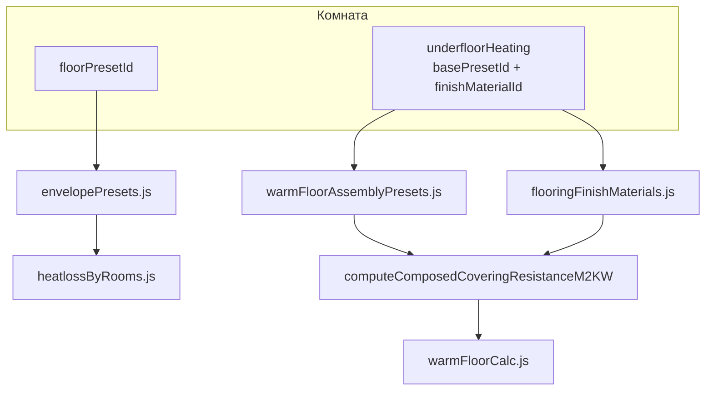
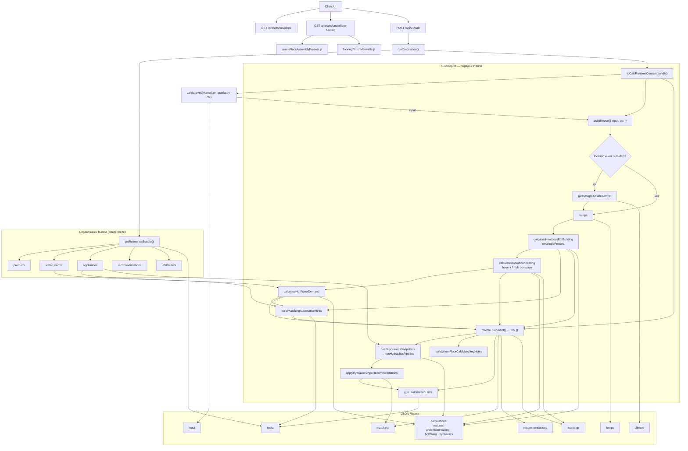
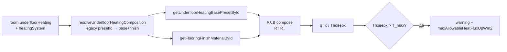
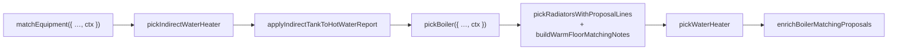

# План проекта

Полные правила backend/frontend — в [`.cursorrules`](.cursorrules). HTTP-контракт — [`openapi.yaml`](openapi.yaml).

## Статус MVP (backend)

| Область | Статус |
|---------|--------|
| REST API, calc, projects | выполнено |
| Климат (Nominatim + Meteostat bulk) | выполнено |
| Теплопотери, ограждения, ГВС, гидравлика | выполнено |
| Matching (котёл, радиаторы, ВН, БКН) | выполнено |
| Справочники (bundle + Mongo/file) | выполнено |
| Runtime barrels `*/public.js` | выполнено |
| Водяной ТП: композиция base + finish, `warmFloorCalc` | выполнено |
| ТП: пресеты 45/35 и 40/30, смеситель, гидравлика узла | фаза 0 ✅ → фазы 1–8 |

## Статус MVP (frontend)

| Область | Статус |
|---------|--------|
| Анкета, формы, отчёт в UI | выполнено |
| `SurveySession` — единый pipeline мутаций и calc-state | выполнено |
| React Query (`@tanstack/react-query`) — справочники, calc, проекты | выполнено |
| Проекты: файлы, hash-URL, Mongo CRUD | выполнено |

## Структура сервиса по папкам

### Корень репозитория

| Путь | Назначение |
|------|------------|
| `openapi.yaml` | Контракт REST API — источник правды для схем запросов и ответов |
| `shared/` | Общие константы backend и frontend (схемы ГВС, тепловые режимы, типы комнат) |
| `package.json` | Скрипты-обёртки для запуска backend и frontend |
| `components/schemas/` | OpenAPI-схемы (CalcInput, CalcReport, RoomUnderfloorHeating, FlooringFinishMaterial и др.) |

### `backend/` — REST API (Node.js + Express)

| Папка / файл | Назначение |
|--------------|------------|
| `src/index.js` | Точка входа: Express, CORS, requestId, логирование |
| `src/api/` | HTTP-слой: роуты `/api/v1/calc`, `/catalog`, `/presets`, проекты; AJV-валидация |
| `src/data/warmFloorAssemblyPresets.js` | **Базы ТП** (`usage: underfloor_heating_base`) — плита, XPS, стяжка, выравнивание |
| `src/data/flooringFinishMaterials.js` | **Финишные покрытия** — керамика, винил, ламинат; δ, λ, лимит Tповерх |
| `src/logic/warmFloorCalc.js` | Расчёт q↑/q↓, Tповерх, warnings; композиция base + finish |
| `src/logic/heatlossByRooms.js` | Теплопотери; **не** импортирует справочники ТП |
| `src/logic/envelopePresets.js` | Ограждения (`usage: building_envelope`) |
| `src/logic/` (прочее) | U стен, ориентация, ГВС; `hydraulics.js` — **deprecated**, только legacy-формулы |
| `src/hydraulics/` | Pure Pipeline: граф, трубы, насосы, `runHydraulicsPipeline.js` |
| `src/matching/warmFloor.js` | Текстовые подсказки matching + цифры из `underfloorHeating` отчёта |
| `src/climate/` | Геокодинг (Nominatim) и климат (Meteostat bulk API) |
| `src/matching/` | Подбор котлов, радиаторов, БКН, бойлеров |
| `src/catalog/` | Загрузка и валидация каталога `products` (MongoDB / JSON) |
| `src/dhw/` | Нормы ГВС, правила техники (`appliances`), формулы водоснабжения |
| `src/reference/` | TTL-кэш справочников (каталог + нормы + appliances + recommendations) |
| `src/recommendations/` | Тексты рекомендаций по кодам `REC_*` / `WARN_*` |
| `src/report/buildReport.js` | Сборка отчёта; вызов `calculateUnderfloorHeating` после теплопотерь |
| `src/models/` | Mongoose-модели MongoDB (Product, Project, Calculation и др.) |
| `src/projects/` | CRUD проектов; `resolveProjectCalcInput.js`, `extractCalculationSummary.js` |
| `src/utils/` | Логер, MongoDB, математика, ограничения монтажа котлов |
| `src/types/shared-types.d.ts` | JSDoc-типы API и отчёта |
| `scripts/verifyCalcInputSchema.js` | Сверка CalcInput.yaml + AJV |
| `scripts/verifyCalcInputValidation.js` | ROOM_TYPE_INVALID, coerceTypes: false |
| `scripts/verifyUfhPresets.js` | Сверка underfloor_heating_presets + maxSurface smoke |
| `scripts/verifyProjectCalcInput.js` | Fallback lastCalcInput для POST .../projects/:id/calc |
| `scripts/verifyExtractCalculationSummary.js` | summary.objectType → enum house/apartment |
| `scripts/verifyHydraulicsPipeline.js` | E2E гидравлика: фикстуры micro_branches, mixing_valve |
| `scripts/verifyPickPipe.js` | Guard Dвн + fallback min/max Ø |
| `scripts/verifyBuiltinBoilerPump.js` | Baxi circulationPump, below_manufacturer_qmin |
| `scripts/verifyFitPumpCurve.js` | Аппроксимация H(Q) из паспортных точек |

Сверка контракта: `openapi.yaml` ↔ `validate.js` ↔ `shared-types.d.ts`.

### `frontend/` — клиент (React + Vite + TypeScript + React Query)

Документация клиента: [`docs/frontend-calc-runner.md`](docs/frontend-calc-runner.md). Черновик анкеты: [`docs/survey-draft.md`](docs/survey-draft.md).

#### Точка входа и корень UI

| Путь | Назначение |
|------|------------|
| `src/main.tsx` | `QueryProvider` → `App` (StrictMode) |
| `src/App.tsx` | `useReferenceData` + `usePresetLists` + `SurveySessionProvider` |
| `src/AppSurveyContent.tsx` | Шаги анкеты, формы, отчёт; `useSurveySession`, `useCatalogEquipmentQuery`, `useSurveyProject` |

#### `src/query/` — React Query (серверные данные)

| Путь | Назначение |
|------|------------|
| `QueryProvider.tsx` | `QueryClientProvider` + devtools (dev) |
| `queryClient.ts`, `queryKeys.ts` | Дефолты кэша и реестр ключей |
| `useDebouncedValue.ts` | Debounce 700 ms для автопересчёта calc |
| `useReferenceData.ts` | Композиция справочных query для `App.tsx` |
| `useSurveyCalc.ts` | POST `/api/v1/calc`: auto `useQuery` + ручная `useMutation` |
| `queries/useEnvelopePresetsQuery.ts` | `GET /api/v1/presets/envelope` |
| `queries/useUnderfloorHeatingPresetsQuery.ts` | `GET /api/v1/presets/underfloor-heating` (bases + finishes) |
| `queries/useUfhModePresetsQuery.ts` | `GET /api/v1/presets/underfloor-heating/modes` |
| `queries/useCatalogEquipmentQuery.ts` | `GET /api/v1/catalog` (+ `reloadCatalog`) |
| `queries/useProjectsListQuery.ts` | Список проектов (диалог) |
| `queries/useProjectCalculationsQuery.ts` | Список расчётов выбранного проекта |
| `mutations/useProjectMutations.ts` | save/load проекта и расчётов |

#### `src/surveySession/` — клиентское состояние анкеты (не React Query)

| Путь | Назначение |
|------|------------|
| `SurveySessionProvider.tsx` | Контекст: `dispatch`, `report`, `uiPhase`, `useSurveyCalc` |
| `surveySessionContext.ts`, `useSurveySession.ts` | Типы контекста и хук доступа |
| `runSurveyMutationPipeline.ts` | `reduce` → `migrateDerivedState` → `decideCalcAction` |
| `buildCalcInputSnapshot.ts` | `buildCalcPayloadFromDraft`, `buildCalcInputKeyFromDraft`, `canAutoCalcFromDraft` |
| `wiringLayoutV3.ts`, `migrateDerivedState.ts` | Layout разводки, синхронизация ТП |
| `surveyDraftBridge.ts` | `SurveyDraft` → `SurveyDraftSnapshot` при `DRAFT_LOADED` |

#### `src/hooks/` — UI-оркестрация (без прямого HTTP)

| Путь | Назначение |
|------|------------|
| `useCalcReport.ts` | Парсинг JSON-отчёта для блоков UI |
| `usePresetLists.ts` | Фильтрация пресетов ограждений по `kind` |
| `useRoomsOrchestration.ts` | Синхронизация комнат с `objectMeta` |
| `useSurveyEstimates.ts` | Локальные оценки до ответа API |
| `useSurveyProject.ts` | Файлы, hash-URL, диалог проектов (поверх RQ mutations/queries) |

#### `src/services/` — HTTP-клиенты (queryFn / mutationFn)

| Путь | Назначение |
|------|------------|
| `calc.ts` | `POST /api/v1/calc` |
| `envelopePresets.ts` | `GET /api/v1/presets/envelope` (+ fallback) |
| `underfloorHeatingPresets.ts` | `GET /api/v1/presets/underfloor-heating` |
| `ufhModePresets.ts` | `GET /api/v1/presets/underfloor-heating/modes` |
| `catalog.ts` | `GET /api/v1/catalog` |
| `projectsApi.ts` | CRUD `/api/v1/projects/*` |
| `buildCalcRequestPayload.ts` | Сборка тела CalcInput (вызывается из `buildCalcInputSnapshot`) |

#### Компоненты, данные, утилиты

| Путь | Назначение |
|------|------------|
| `src/components/WarmFloorSection/` | Режим emitters, карточки ТП |
| `src/components/RoomsForm/RoomAccordionItem.tsx` | Основа ТП + финишное покрытие в комнате |
| `src/components/RecommendationsBlock/` | Отчёт: теплопотери, котёл, радиаторы, ТП, гидравлика |
| `src/components/HydraulicsProposal/` | Блок `matching.hydraulics` |
| `src/components/CatalogEquipmentReference/` | Справочник номенклатуры из каталога |
| `src/components/ProjectsDialog/` | Диалог проектов на сервере |
| `src/data/fallback*.ts` | Офлайн-fallback справочников |
| `src/utils/migrateRoomUnderfloorHeating.ts` | Legacy `presetId` → base + finish |
| `src/styles/` | Общие CSS-переменные и элементы форм |

В заголовке каждого исходного файла — комментарий «Назначение / Описание».

### Гидравлика и тёплый пол

| Модуль | Где | Что делает | Статус UI |
|--------|-----|------------|-----------|
| **Гидравлика** | `hydraulics/public.js` | Pure Pipeline: DTO → граф → Δp → подбор труб/насосов из каталога | Шаг в анкете + блок в RecommendationsBlock |

**Гидравлика — подбор труб и микроветки (выполнено):** см. [`docs/hydraulics-pipeline.md`](docs/hydraulics-pipeline.md).

| # | Задача | Статус |
|---|--------|--------|
| H.1 | Трёхрежимный fallback `pickPipe.js` (optimal / max Ø / min Ø) | ✅ |
| H.2 | `velocityLimitsMps.branchMin`, `radiatorBranchGrouping` в `appliances.hydraulics` (v3→v4) | ✅ |
| H.3 | Группировка микроветок → узел `radiator_manifold` (`groupRadiatorGraphBranches.js`) | ✅ |
| H.4 | Рекомендации `WARN_PIPE_VELOCITY_*`, `REC_RADIATOR_MICRO_BRANCH_MANIFOLD` | ✅ |
| H.5 | `npm run verify:pick-pipe`, фикстура `apartment_mixed_ufh_micro_branches` в `verify:hydraulics-pipeline` | ✅ |
| H.6 | `isMainLine` в графе (`e_boiler_main`, `e_boiler_separator`, `e_main_to_mixing`) | ✅ |
| H.7 | Guard `mainTransitMinInternalDiameterMm` / `branchMinInternalDiameterMm` в `pickPipe.js` | ✅ |
| H.8 | Рекомендации `WARN_PIPE_MAIN_TRANSIT_*`, `WARN_PIPE_CATALOG_*`, `REC_PIPE_MAIN_TRANSIT_GUARD_APPLIED` | ✅ |
| H.9 | `verify:pipe-catalog-pool-filter`, фикстура `apartment_mixed_ufh_mixing_valve` | ✅ |
| H.10 | `SurveySession` pipeline (`dispatch` → migrate → calc), `wiringLayoutV3`, `verify:survey-session` | ✅ |
| H.14 | Интеграция `radiatorWiringSystemType` в граф: фабрика `buildRadiatorSubgraph.js`, dead-end / pass / manifold | ✅ |
| H.11 | `circulationPump` Baxi ECO Home 24 F + Luna Duo-Tec E 33 (6 режимов, полезный H) | ✅ |
| H.12 | Ф2: `below_manufacturer_qmin`, `curve_unavailable`, без catalog fallback для wall boiler | ✅ |
| H.13 | Ф5 «Тамбур»: микронагрузка радиаторов (`resolveMicroLoadRadiatorStrategy`, тип `тамбур`) | ✅ |
| **ТП — расчёт** | `logic/warmFloorCalc.js` | Rλ,B = база над контуром + финиш; q↑/q↓, Tповерх, `maxAllowableHeatFluxUpWm2`; warning при превышении лимита покрытия | Результат в `RecommendationsBlock` |
| **ТП — matching** | `matching/warmFloor.js` | Подсказки в `radiatorSelectionNotes` + цифры из отчёта ТП | Шаг `warmFloor` + селекты в комнатах |
| **ТП — heatloss** | `heatlossByRooms.js` + `floorPresetId` | Теплопотери через пол; при `bottomBoundary: heated` пол не считается | Поле «Пол (ограждение)» в комнате |

---

## Тёплый пол: пресеты покрытий и разделение расчётов

**Статус:** фазы 0–8 — **выполнено**
**Цель:** расчёт Вт/м² ТП по **композиции** «базовый конструктив + финишное покрытие» (керамика, клеевой/замковый винил, ламинат), лимит Tповерх из материала (27 °C или до 35 °C для керамики), без смешения с теплопотерями через `floorPresetId`.

### Проблема

Две разные физические задачи нельзя решать одним `floorPresetId` или одним монолитным JSON-пирогом на каждую комбинацию покрытия:

| Задача | Потребитель | Справочник |
|--------|-------------|------------|
| Теплопотери пола к холодной зоне снизу | `heatlossByRooms.js` | `envelopePresets.js` (`building_envelope`) |
| Проектирование ТП: q↑/q↓, Tповерх, гидравлика | `warmFloorCalc.js` | `warmFloorAssemblyPresets.js` (базы) + `flooringFinishMaterials.js` (финиш) |

Монолитные пресеты `underfloor_heating_glued_*` / `underfloor_heating_floating_*` **заменены** композицией; legacy `presetId` мигрируется на сервере и во frontend.

### Согласованная архитектура

| Поле | Назначение |
|------|------------|
| `room.floorPresetId` → `envelopeElements[kind=floor]` | Ограждение для heatloss |
| `room.underfloorHeating.enabled` | ТП включён в комнате |
| `room.underfloorHeating.basePresetId` | База: плита + XPS + стяжка + выравнивание |
| `room.underfloorHeating.finishMaterialId` | Финиш: ceramic / pvc_glue / pvc_click / laminate_click |
| `heatingSystem.waterUnderfloorHeating` | Мастер-флаг «в проекте есть водяной ТП» |
| `room.roomExteriorLayout` | Положение помещения: `corner` / `facade` / `internal` (только frontend-черновик; в API — `envelopeElements`) |

Подробнее: [`docs/room-exterior-layout.md`](docs/room-exterior-layout.md).

**Формула Rλ,B (упрощённо):**

```
Rλ,B = R(слои базы над isHeatingLayer) + δ_finish / λ_finish
T_max поверхности = finish.maxSurfaceTemperatureCelsius
q↑ при заданном контуре = (Tср_контура − Tкомнаты) / R↑_полный
warning, если Tповерх > T_max
```



### Справочники (текущее содержимое)

**База** (`ufh_base_interstory_screed_65`): плита 150 мм, XPS 30 мм, стяжка ТП 65 мм (`isHeatingLayer`), самовыравнивание 5 мм.

**Финиши** (`flooringFinishMaterials.js`):

| id | Покрытие | Rλ,B финиша (ориентир) | T max |
|----|----------|------------------------|-------|
| `ceramic_tile` | Керамика / керамогранит (+ клей) | ≈0,011 | 35 °C |
| `pvc_glue` | Клейовий кварцвініл / LVT | ≈0,015 | 27 °C |
| `pvc_click` | Замковий SPC/LVT + підкладка | ≈0,046 | 27 °C |
| `laminate_click` | Ламінат + підкладка ТП | ≈0,100 | 27 °C |

### API пресетов (не в calc-bundle)

| Метод | Путь | Ответ |
|-------|------|-------|
| GET | `/api/v1/presets/envelope` | `ENVELOPE_PRESETS` — только ограждения |
| GET | `/api/v1/presets/underfloor-heating` | `{ ok, bases, finishes }` — bundle для UI |
| GET | `/api/v1/presets/underfloor-heating/bases` | `{ ok, bases }` |
| GET | `/api/v1/presets/flooring-finishes` | `{ ok, finishes }` |

---

### Фаза 0 — Справочники ТП (backend) ✅

| # | Задача | Статус |
|---|--------|--------|
| 0.1 | `warmFloorAssemblyPresets.js` — базы (`underfloor_heating_base`) | ✅ |
| 0.2 | `flooringFinishMaterials.js` — 4 финиша | ✅ |
| 0.3 | `computeComposedCoveringResistanceM2KW`, `resolveUnderfloorHeatingComposition` | ✅ |
| 0.4 | Типы: `UnderfloorHeatingBasePreset`, `FlooringFinishMaterial` | ✅ |
| 0.5 | GET bundle + `/bases` + `/flooring-finishes` | ✅ |
| 0.6 | OpenAPI: `UnderfloorHeatingBasePreset.yaml`, `FlooringFinishMaterial.yaml`, `RoomUnderfloorHeating.yaml` | ✅ |

---

## Помещения: `roomExteriorLayout` (дом и квартира) ✅

| # | Задача | Статус |
|---|--------|--------|
| R.1 | Тип `RoomExteriorLayout`, поле в `RoomFormValue` | ✅ |
| R.2 | `roomExteriorLayout.ts` — infer, UI configs, payload | ✅ |
| R.3 | Селектор в `RoomAccordionItem` + динамические поля стен | ✅ |
| R.4 | `buildCalcRequestPayload` — internal → `construction` коридорной стены | ✅ |
| R.5 | Миграция черновика (`externalWall2 > 0` → corner) | ✅ |
| R.6 | Документация: `docs/room-exterior-layout.md`, OpenAPI example | ✅ |
| R.7 | Backend: ΔT коридора, U перегородки, corner ×1.08, validate wall count | ✅ |
| R.8 | `verifyRoomExteriorLayoutHeatLoss.js` | ✅ |

**DoD:** … `internal` — 1 коридорная стена, ΔT к ~15 °C (U из objectMeta). …

### Фаза 1 — Модель комнаты и контракт API (ТП) ✅

| # | Задача | Статус |
|---|--------|--------|
| 1.1 | `RoomUnderfloorHeatingInput`: `basePresetId`, `finishMaterialId` | ✅ |
| 1.2 | `RoomFormValue` / миграция legacy `presetId` | ✅ |
| 1.3 | `RoomUnderfloorHeating.yaml` + `CalcInput.yaml` | ✅ |
| 1.4 | `buildCalcRequestPayload` → `building.rooms` (не в `envelopeElements`) | ✅ |
| 1.5 | `migrateRoomUnderfloorHeating`, `surveyCalcInputKey` | ✅ |
| 1.6 | `assertEnvelopeFloorPresetsNotUnderfloorHeating` + блок legacy id в envelope | ✅ |

### Фаза 2 — Расчётный модуль ТП (backend) ✅

| # | Задача | Файл | Статус |
|---|--------|------|--------|
| 2.1 | R↑, R↓, q↑/q↓ Вт/м², Tповерх, лимит из финиша | `warmFloorCalc.js` | ✅ |
| 2.2 | Паразитный поток вниз при `bottomBoundary: heated` | `warmFloorCalc.js` | ✅ |
| 2.3 | Контур ТП 45/35 при котле >50 °C (смесительный узел) | `warmFloorCalc.js` | ✅ |
| 2.4 | `report.calculations.underfloorHeating` | `buildReport.js` | ✅ |
| 2.5 | `maxAllowableHeatFluxUpWm2`, warnings в `report.warnings` | `warmFloorCalc.js` | ✅ |
| 2.6 | Подсказки matching с цифрами и именем финиша | `warmFloor.js` | ✅ |

### Фаза 3 — Frontend UI ✅

| # | Задача | Статус |
|---|--------|--------|
| 3.1 | `fetchUnderfloorHeatingPresets()`, `useUnderfloorHeatingPresetsQuery` | ✅ |
| 3.2 | Два селекта: основа ТП + финиш в `RoomAccordionItem` | ✅ |
| 3.3 | Блок «Тёплый пол» в `RecommendationsBlock` | ✅ |
| 3.4 | Fallback: `fallbackUnderfloorHeatingPresets.ts`, `fallbackFlooringFinishes.ts` | ✅ |

### Фаза 4 — Композиция base + finish (рефакторинг монолита) ✅

| # | Задача | Статус |
|---|--------|--------|
| 4.1 | Убраны монолитные пироги; одна база + N финишей | ✅ |
| 4.2 | Ламинат и керамика в справочнике финишей | ✅ |
| 4.3 | Лимит T: 27 °C (винил/ламинат), 35 °C (керамика) | ✅ |
| 4.4 | Миграция `underfloor_heating_glued_*` → base + `pvc_glue` | ✅ |
| 4.5 | Миграция `underfloor_heating_floating_*` → base + `pvc_click` | ✅ |

### Критерии готовности (DoD)

**Разделение heatloss и ТП**

- [x] Справочник ТП (базы + финиши) отдельно от `ENVELOPE_PRESETS`
- [x] `GET /presets/envelope` не отдаёт пресеты ТП
- [x] `heatlossByRooms` не импортирует `warmFloorAssemblyPresets` / `flooringFinishMaterials`
- [x] `floorPresetId` (envelope) и `underfloorHeating` (комната) не перезаписывают друг друга
- [x] `presetId` сборки ТП в `envelopeElements[kind=floor]` → 400

**Композиция base + finish**

- [x] Контракт: `underfloorHeating: { enabled, basePresetId, finishMaterialId }`
- [x] Один базовый конструктив + 4 финиша без дублирования полного пирога
- [x] Rλ,B = база над контуром + δ/λ финиша
- [x] `maxSurfaceTemperatureCelsius` берётся из финиша, не из базы
- [x] API: bundle, `/bases`, `/flooring-finishes`
- [x] UI: два селекта в комнате; отчёт показывает основу и покрытие

**Расчёт и предупреждения**

- [x] `calculateUnderfloorHeating` в пайплайне после `calculateHeatLossForBuilding`
- [x] q↑ Вт/м² и Tповерх в `report.calculations.underfloorHeating`
- [x] `Tповерх = Tкомн + q↑ × Rфиниш` (Rконв только в R↑ для q↑)
- [x] `pipeSpacingMm` в анкете (100 / 150 / 200); `R_embed` из `R_PIPE_EMBEDMENT_BY_STEP` + `rScreedHalf`
- [x] `WARN_FLOOR_OVERHEATING_MATERIAL` / `WARN_FLOOR_OVERHEATING_COMFORT` через `recommendationResolver`
- [x] `REC_UFH_ACTION_INCREASE_SPACING` / `REC_UFH_ACTION_CHANGE_FINISH` при перегреве
- [x] Паразитный q↓ при `bottomBoundary: heated`
- [x] `maxAllowableHeatFluxUpWm2` в отчёте по комнате

**Вне scope (не планируется)**

- **Тепловой насос** — отдельный класс оборудования; в каталоге и matching **нет** и **не планируется** (MVP: газовые/электрокотлы Baxi-класса).

**Backlog (узкий scope)**

- [ ] **Валидатор Tпод радиаторов** (обратный расчёт **только** как проверка достаточности подобранных секций): при фиксированных модели/числе секций и нагрузке комнаты — минимальная требуемая `supplyC`, при которой прибор закрывает `radiatorDesignWatts`; сравнение с выбранным графиком анкеты и паспортом котла (предупреждение, не пересчёт подбора). **Не** универсальный «подбор T под мощность» и **не** для ТП/насосов. Док.: [`docs/heating-schemes-thermal-regime.md`](docs/heating-schemes-thermal-regime.md) § Валидатор Tпод.
- [x] Шаг гидравлики в UI (форма `input.hydraulics`)
- [x] Сценарий «только ТП» с котлом на 40/30 без радиаторов (`ufhPresetId=ufh_only`, v3)
- [x] Пресет «Тамбур» (входная зона): при остаточной нагрузке &lt; 150 Вт — минимальный прибор для `прихожая`/`коридор`/`тамбур` и фасада; для внутренних — skip + микроколлектор. Модуль: `resolveMicroLoadRadiatorStrategy.js`; verify: `npm run verify:micro-load-radiator`

---

## Roadmap: контур ТП, смеситель, гидравлика (фазы 0–8)

**Статус:** фазы 0–8 и план v3 — **выполнено** (код + UI + verify).

Детальный чеклист ручного теста: [`docs/ufh-roadmap-test-checklist.md`](docs/ufh-roadmap-test-checklist.md).

### Продуктовые правила (массовый рынок)

| Контур | Пресет | Когда |
|--------|--------|-------|
| **Радиаторы, традиционный котёл** | **75/65** °C (`traditional_dt50_75_65`) | Дом, квартира 1К — базовый |
| **Радиаторы, конденсационный** | **55/45** °C (`condensing_dt30_55_45`) | Квартира 2К (рекомендация); primary — по выбранному графику анкеты; **lineEfficient** — 55/45; warning при condensing + 75/65 |
| **Тёплый пол** | **45/35** или **40/30** °C | Отдельно от котла; по **финишу** комнаты |
| **95/85** | `traditional_high_dt70_95_85` | **Устаревший** — только обратная совместимость API |
| **Тепловой насос** | — | **Вне scope** — оборудования нет в каталоге |

Оба пресета ТП имеют **Δt = 10 K** → формула расхода теплоносителя **одинакова**; различается **q↑** (ниже при 40/30) и проверка покрытия теплопотерь комнаты.

### Пресеты контура ТП (`UfhCircuitPresetId`)

| id | График | Финиш (`finishMaterialId`) |
|----|--------|----------------------------|
| `ufh_dt10_45_35` | 45/35 °C | `ceramic_tile` (плитка, керамогранит) |
| `ufh_dt10_40_30` | 40/30 °C | `pvc_glue`, `pvc_click`, `laminate_click` |

Выбор **автоматический** по финишу; ручной override — backlog.

### Смесительный узел (сквозное правило)

```
isMixingNodeRequired = heatingSystem.supplyC > ufhCircuit.supplyC
```

| Сценарий | Котёл | ТП | Смеситель |
|----------|-------|-----|-----------|
| Традиционный + радиаторы + ТП (плитка) | 75 | 45 | **да** |
| Конденсационный + радиаторы + ТП (ламинат) | 55 | 40 | **да** |
| Только ТП, котёл на 40/30 | 40 | 40 | **нет** |

Заменяет legacy-эвристику `supply > 50` в `warmFloorCalc.js` (фаза 3).

### Схема распределения (`UfhDistributionPreset`)

При `isMixingNodeRequired === true`:

| Значение | Назначение |
|----------|------------|
| `collector_mixing_valve` | НСУ на коллекторе (квартира, малый дом) |
| `hydraulic_separator` | Гидрострелка + зоны (крупный дом) |
| `auto` | Сервер: пороги в `appliances.underfloor_heating` |

### Формулы узла смешения (`UfhMixingNodeSpec`)

- **Расход:** `Q_m³/ч = P_kW × 0.86 / (Δt × ρ)`, Δt = 10, ρ ≈ 1
- **Напор H:** ориентир 3–4 м (малый объект) или 5–6 м (крупный)
- **Kvs клапана:** `Kvs = Q / Δp`, Δp ≈ 0,15–0,2 бар

Номенклатура насосов/клапанов из `products` **не подбирается** — только технические требования в отчёте.

### Правило модульности (обязательно)

**Один файл — одна зона ответственности.** Не раздувать `warmFloorCalc.js` (~190 строк) и `RoomAccordionItem.tsx`.

| Модуль | Назначение |
|--------|------------|
| `shared/ufhCircuitPresets.js` | 45/35, 40/30, маппинг finish → preset |
| `shared/ufhDistributionPresets.js` | enum НСУ / гидрострелка |
| `logic/ufhCircuitResolve.js` | finish → пресет контура |
| `logic/ufhMixingNode.js` | `isMixingNodeRequired` |
| `logic/ufhMixingNodeHydraulics.js` | Q, H, Kvs |
| `logic/ufhRoomHeatFlux.js` | q↑, Tповерх (вырезать из warmFloorCalc) |
| `logic/ufhRoomCoverageCheck.js` | ТП vs теплопотери комнаты |
| `logic/ufhDistributionResolve.js` | auto → НСУ / гидрострелка |
| `logic/ufhHydraulicsCircuit.js` | расход ТП, Δt = 10 |
| `logic/warmFloorCalc.js` | **только оркестратор** |
| `components/UnderfloorHeatingReport/UfhMixingNodeSpecCard.tsx` | UI спецификации узла |

### Фазы реализации

| Фаза | Содержание | Статус |
|------|------------|--------|
| **0** | `Plan.md`, OpenAPI-черновик, чеклист тестов | ✅ выполнено |
| **1** | UX окон: подсказки «Добавить окно» vs `count` | ✅ выполнено |
| **2** | 75/65 / 55/45; 95/85 deprecated в UI | ✅ выполнено |
| **3** | Пресеты ТП, смеситель, покрытие теплопотерь | ✅ выполнено |
| **4** | UI `underfloorDistributionPreset` | ✅ выполнено |
| **5** | `UfhMixingNodeSpec` в отчёте | ✅ выполнено |
| **6** | Раздельная гидравлика ТП (Δt=10) | ✅ выполнено |
| **7** | `appliances.underfloor_heating`, REC/WARN | ✅ выполнено |
| **8** | `verify:calc-schema`, curl/UI тесты | ✅ выполнено |

### План v3 (схемы котла, unlock графика, пресеты ТП Mongo) — ✅ выполнено

| Блок | Содержание | Документация |
|------|------------|--------------|
| 5 схем ГВС/котла | incl. `singleCircuitBoilerWithBufferElectricStorage` | [`docs/heating-schemes-thermal-regime.md`](docs/heating-schemes-thermal-regime.md) |
| UI «Водонагреватель» | `WaterHeaterForm`, `waterHeaterForm` в `SurveyDraft`, `migrateSurveyDraft`, без ручного выбора модели | [`docs/water-heater-form.md`](docs/water-heater-form.md) |
| Unlock графика | рекомендация 75/65 vs 55/45, расчёт по выбору пользователя | там же |
| Mongo `underfloor_heating_presets` | 3 режима, `GET …/modes`, seed, bundle | [`docs/ufh-presets-mongo.md`](docs/ufh-presets-mongo.md) |
| `ufh_only` | skip радиаторов; котёл от `totalHeatFluxUpWatts` | там же |
| `maxSurface` из пресета | min(preset, финиш) в `ufhRoomHeatFlux.js` | там же |
| Verify | `npm run verify:ufh-presets` | `backend/scripts/verifyUfhPresets.js` |
| Чеклист | ручные сценарии v3 | [`docs/heating-schemes-test-checklist.md`](docs/heating-schemes-test-checklist.md) |

### План v4 — мебель на полу ТП (S_meb → S_акт)

| Блок | Содержание | Документация |
|------|------------|--------------|
| Анкета | `furnitureOccupiedAreaM2` в `room.underfloorHeating` | [`docs/ufh-furniture-active-area.md`](docs/ufh-furniture-active-area.md) |
| Расчёт | S_акт, q_треб, авто-шаг (вариант B), длина петли (`loopLengthM`) | там же |
| Рекомендации | `WARN_UFH_ACTIVE_AREA_INSUFFICIENT`, `REC_UFH_PIPE_SPACING_AUTO`, … | `recommendations.json` |
| Verify | `npm run verify:ufh-active-area` | `backend/scripts/verifyUfhActiveArea.js` |

---

## Поток расчёта

### POST /api/v1/calc

**Порядок HTTP calc:** `runCalculation(body)` в `api/runCalculation.js` (внутри: `getReferenceBundle()` → `toCalcRuntimeContext(bundle)` → `validateAndNormalizeInput(body, ctx)` → `buildReport({ input, ctx })`). Вызывается из `routes.js` (`POST /api/v1/calc`) и `projectsRoutes.js` (`POST /api/v1/projects/:id/calc`).

**В bundle calc:** `catalog`, `waterNorms`, `appliances`, `recommendations`, `ufhPresets`. Контекст расчёта — **`CalcRuntimeContext`** (`docs/calc-runtime-context.md`); bundle при загрузке — `deepFreeze`. **On-demand invalidate:** `POST /api/v1/system/invalidate-reference-cache` (после seed / правки Mongo; `SYSTEM_INTERNAL_TOKEN`, generation guard в `configCache.js`).

**Вне calc-потока (загрузка UI / справочники):**

- `GET /api/v1/presets/envelope` → `envelopePresets.js`
- `GET /api/v1/presets/underfloor-heating` → `warmFloorAssemblyPresets.js` + `flooringFinishMaterials.js`
- `GET /api/v1/presets/underfloor-heating/bases`
- `GET /api/v1/presets/underfloor-heating/modes` → Mongo/file `underfloor_heating_presets` (режимы v3)



### Внутри `calculateUnderfloorHeating` (по комнате)



### Внутри `matchEquipment`



После matching в `buildReport` дополнительно мержатся `buildWarmFloorCalcMatchingNotes(underfloorHeating)` в `radiatorSelectionNotes`.

---

## Тестирование

См. **Test Quickstart** в [`.cursorrules`](.cursorrules) (`LOG_LEVEL=debug`, curl calc/400/404).

**Гидравлика (backend verify):**

```bash
cd backend && npm run verify:hydraulics-pipeline
cd backend && npm run verify:pick-pipe
cd backend && npm run verify:builtin-boiler-pump
```

**Сессия анкеты (frontend):**

```bash
cd frontend && npm run verify:survey-session
```

**Пресеты ТП:**

```bash
curl -s http://localhost:3001/api/v1/presets/underfloor-heating | head -c 500
curl -s http://localhost:3001/api/v1/presets/flooring-finishes
```

**Схема CalcInput:**

```bash
cd backend && npm run verify:calc-schema
```

**Ожидаемое поведение calc с ТП:** при `waterUnderfloorHeating: true`, комната с `basePresetId: ufh_base_interstory_screed_65` и `finishMaterialId: laminate_click` — в отчёте `calculations.underfloorHeating.rooms[].coveringResistanceM2KW ≈ 0.10`, warning при Tповерх > 27 °C на контуре 45/35 °C.
