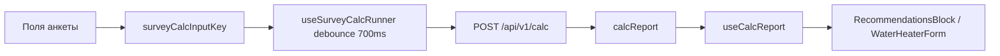

# Frontend: оркестрация расчёта (useSurveyCalcRunner)

Документ описывает слой клиента, который вызывает `POST /api/v1/calc`, хранит отчёт и синхронизируется с формой анкеты.

---

## SSOT calc-state на клиенте

| Ответственность | Модуль |
|-----------------|--------|
| Состояние `calcLoading` / `calcError` / `calcReport` | `frontend/src/hooks/useSurveyCalcRunner.ts` |
| Debounce автопересчёта (`SURVEY_CALC_DEBOUNCE_MS = 700`) | тот же хук |
| Сборка тела запроса | `frontend/src/services/buildCalcRequestPayload.ts` |
| Ключ изменений входа (для debounce) | `frontend/src/utils/surveyCalcInputKey.ts` |
| Парсинг отчёта для UI | `frontend/src/hooks/useCalcReport.ts` |

`App.tsx` **не** хранит calc-state напрямую и **не** вызывает `postCalc` — только подключает хук и передаёт `buildCalcPayload`, `canAutoCalc`, `calcInputKey`.

---

## API хука

```typescript
const {
  calcLoading,
  calcError,
  calcReport,
  setCalcReport,           // useSurveyProject (сохранение расчёта на сервер)
  invalidateCalcReport,    // сброс отчёта при изменении формы
  restoreCalcReport,       // загрузка lastCalcReport из черновика
  runApiCalc,              // ручной пересчёт (кнопка)
} = useSurveyCalcRunner({ buildCalcPayload, canAutoCalc, calcInputKey });
```

### `invalidateCalcReport()`

Единая точка сброса отчёта при изменении полей, влияющих на calc:

- смена схемы ГВС / формы водонагревателя;
- смена температурного пресета котла;
- включение/выключение ТП;
- смена пресета режима ТП.

Не вызывает `setCalcError(null)` — ошибка последнего запроса сохраняется до следующего успешного `runApiCalc` или `restoreCalcReport`.

### `restoreCalcReport(report)`

Используется в `applySurveyDraftState` при загрузке проекта: восстанавливает `lastCalcReport` и очищает `calcError`.

---

## Поток автопересчёта



1. Пользователь меняет поле → при необходимости `invalidateCalcReport()`.
2. `calcInputKey` меняется → хук планирует `runApiCalc` через 700 ms.
3. Ответ кладётся в `calcReport` → `useCalcReport` обновляет карточки matching.

---

## Защита от гонок

`runApiCalc` увеличивает `calcSeqRef` на каждый запрос. Устаревший ответ (seq ≠ текущий) игнорируется — актуально при быстрых изменениях формы.

---

## Связанные хуки анкеты (`App.tsx`)

| Хук | Назначение |
|-----|------------|
| `useSurveyCalcRunner` | calc API + report state |
| `useCalcReport` | парсинг report → DTO для UI |
| `useSurveyProject` | файлы, Mongo, hash-URL |
| `useRoomsOrchestration` | синхронизация комнат с objectMeta |
| `useSurveyEstimates` | локальные оценки до API |

---

## Verify

```bash
cd frontend && npm run lint && npm run build
cd backend && npm run verify:survey-draft-migration && npm run verify:water-heater-form
```

См. также: [`water-heater-form.md`](water-heater-form.md), [`survey-draft.md`](survey-draft.md).
