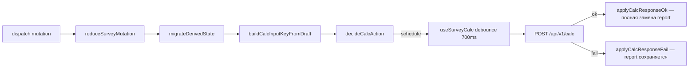

# Frontend: оркестрация расчёта (SurveySession + React Query)

Документ описывает слой клиента: единая сессия анкеты, вызов `POST /api/v1/calc`, хранение отчёта и синхронизация с формой.

См. также: [`survey-draft.md`](survey-draft.md), [`hydraulics-pipeline.md`](hydraulics-pipeline.md) § SurveySession.

---

## SSOT calc-state на клиенте

| Ответственность | Модуль |
|-----------------|--------|
| Состояние `report`, `uiPhase`, `calcInputKey`, черновик | `frontend/src/surveySession/SurveySessionProvider.tsx` |
| Контекст сессии (хук) | `frontend/src/surveySession/useSurveySession.ts` |
| Pipeline мутаций | `runSurveyMutationPipeline.ts` → `reduceSurveyMutation` → `migrateDerivedState` → `decideCalcAction` |
| HTTP calc (debounce, dedup, отмена гонок) | `frontend/src/query/useSurveyCalc.ts` (React Query) |
| Справочники (GET) | `frontend/src/query/queries/*`, композиция — `useReferenceData.ts` |
| Проекты (CRUD) | `frontend/src/query/mutations/useProjectMutations.ts`, `useProjectsListQuery`, `useProjectCalculationsQuery` |
| Сборка тела запроса | `buildCalcPayloadFromDraft` в `buildCalcInputSnapshot.ts` |
| Ключ изменений входа | `buildCalcInputKeyFromDraft` в том же модуле |
| Парсинг отчёта для UI | `frontend/src/hooks/useCalcReport.ts` |

`main.tsx` оборачивает приложение в `QueryProvider` (`@tanstack/react-query`). `App.tsx` — справочники и `SurveySessionProvider`. **`calcReport` не хранится в `App.tsx`** — компоненты читают `report` из контекста сессии.

---

## Pipeline мутации



### `uiPhase`

| Значение | Когда |
|----------|--------|
| `idle` | Нет отчёта, нет пересчёта |
| `stable` | Отчёт актуален |
| `recalculating` | Запланирован или идёт POST calc |
| `error` | Ошибка calc; предыдущий отчёт **не** сбрасывается |

После `schedule` → `uiPhase=recalculating`. Если автозапрос пропустил POST из‑за dedup payload —
`applyCalcSkippedDedup` возвращает `stable` (есть report) или `idle`.

### Смена режима отопления (`HEATING_EMITTERS_MODE_SET`)

При переходе на «Классика» (`presetId: null`):

- сбрасываются `ufhPresetId`, `waterUnderfloorHeating`;
- ТП в комнатах отключается (`enabled: false`);
- пересобирается `wiringLayoutV3`;
- `calcInputKey` меняется → `decideCalcAction` → `schedule` → `uiPhase=recalculating`;
- после успешного POST отчёт **заменяется целиком** (`applyCalcResponseOk`), без domain-merge и без `null` между ответами.

Пока идёт пересчёт, в UI может отображаться **предыдущий** отчёт с индикатором загрузки — это ожидаемо.
При dedup payload индикатор снимается через `applyCalcSkippedDedup` (без нового POST).

### `wiringLayoutV3`

Черновик v4 хранит layout разводки (`systemType`, ветки). При `WIRING_SCHEME_SET` и `SET_ROOMS` — `migrateWiringLayoutOnSystemTypeChange` / `adaptFlatRoomsToWiringLayout`. Ручной ввод длин и порядка — `WIRING_BRANCH_LENGTH_SET`, `WIRING_BRANCH_REORDER` (UI: `HydraulicsSection`). На сервер уходит через `buildCalcPayloadFromDraft`; граф гидравлики строится в `buildGraph.js`.

---

## React Query: calc

```typescript
const {
  calcLoading,
  calcError,
  scheduleFreshCalc,
  runApiCalc,
  abortInFlightCalc,
} = useSurveyCalc({
  buildCalcPayload,
  canAutoCalc,
  calcInputKey,
  onCalcSuccess,
  onCalcError,
  draftInitializing,
});
```

Отчёт **не** кэшируется в React Query — после успешного POST колбэк пишет `report` в `SurveySession`.

### Debounce и dedup

- `SURVEY_CALC_DEBOUNCE_MS = 700` (`useDebouncedValue` + `useQuery`)
- Перед POST сравнивается `JSON.stringify(payload)` с последним успешным — дубликаты не уходят
- При dedup (`CALC_SKIP_DEDUP`) вызывается `applyCalcSkippedDedup` → `uiPhase` снова `stable`/`idle`
  (иначе баннер «Обновление расчёта…» зависал бы при неизменном payload)
- `runApiCalc` (кнопка «Отправить расчёт на сервер» в `calcApiBar`, только `import.meta.env.DEV`) — `useMutation`, сброс dedup и немедленный POST; production UI без бара, клиент опирается на автопересчёт
- `abortInFlightCalc` — `queryClient.cancelQueries({ queryKey: ['calc'] })`

### UI блока «Тёплый пол»

- **Шаг `warmFloor` (`WarmFloorSection`):** кнопка «Отчёт по расчёту ТП» открывает модалку
  (`UnderfloorHeatingReportDialog`) с полным расчётом ТП, унибоксами и **зональным насосом ТП**
  (только если `isMixingNodeRequired`; иначе текст «циркуляция насосом котла»). Котловой насос
  (`boiler_primary`) в отчёте ТП не показывается.
- **Сайдбар «Итог»:** `UnderfloorHeatingSummaryTable` — агрегаты (в т.ч. строка насоса ТП).
  `HydraulicsProposalSection` показывает насосы **без** зон `ufh_*` (без дубля с отчётом ТП).
- Модалка активна, если в отчёте есть комнаты ТП и/или warnings (или есть строки/warnings унибоксов).
  Пустой `rooms[]` без warnings — кнопка неактивна.

### Загрузка черновика

`DRAFT_LOADED` выставляет `draftInitializing` в pipeline; автопересчёт заблокирован (`enabled: false`). После `endDraftInitializationPhase` — `scheduleFreshCalc`.

---

## React Query: справочники

| Query | Ключ | Сервис |
|-------|------|--------|
| Пресеты ограждений | `['presets','envelope']` | `fetchEnvelopePresets` |
| Базы ТП + финиш | `['presets','underfloor-heating']` | `fetchUnderfloorHeatingPresets` |
| Режимы ТП | `['presets','ufh-modes']` | `fetchUfhModePresets` |
| Каталог | `['catalog']` | `fetchCatalogEquipment` |

`reloadCatalog` — `invalidateQueries` + `refetch` (`useCatalogEquipmentQuery`).

---

## Связанные модули

| Модуль | Назначение |
|--------|------------|
| `QueryProvider` | `QueryClientProvider` + devtools |
| `SurveySessionProvider` | контекст, `dispatch`, `report`, `uiPhase` |
| `useSurveyCalc` | calc API (авто query + ручная mutation) |
| `useReferenceData` | композиция справочных query |
| `useCalcReport` | парсинг report → DTO для UI |
| `useSurveyProject` | файлы, Mongo, hash-URL (поверх project mutations) |
| `useRoomsOrchestration` | синхронизация комнат с objectMeta |
| `useSurveyEstimates` | локальные оценки до API |
| `constants/surveySteps.ts` | SSOT шагов: `SURVEY_STEPS`, навигация, `isSurveyStep` |
| `HydraulicsProposalSection` | блок гидравлики из `matching.hydraulics` |

Ручной `invalidateCalcReport()` в формах **не нужен** — пересчёт централизован в сессии.

### Шаги анкеты (навигация)

Порядок и подписи шагов — **`frontend/src/constants/surveySteps.ts`** (`SURVEY_STEPS`, `SURVEY_STEP_NAV_ITEMS`). `AppSurveyContent` рендерит боковую навигацию из этого списка; `migrateSurveyDraft` валидирует `currentStep` через `isSurveyStep`. Новый шаг добавляется **только** в `SURVEY_STEPS` и в union `SurveyCurrentStep` (`types/surveyStep.ts`).

Канонический порядок `SURVEY_STEPS`:

`object` → `warmFloor` → `rooms` → `hotWater` → `boiler` → `radiators` → `waterHeater` → `hydraulics` → `summary`

Шаг «Тёплый пол» стоит сразу после «Объект» и перед «Помещения»: глобальный флаг / `ufhPresetId` задают схему излучателей до заполнения комнат.

---

## Verify

Перед сдачей на чистой кодовой базе:

```bash
cd frontend && npm run verify
```

- **`npm run verify`** — exit `0` обязателен (`lint` + **`typecheck`** + `verify:dead-code`/knip + **`build`** + `verify:survey-session`).
- `verify:survey-session` читает `dist/assets` (поэтому build входит в `verify`).
- ESLint: `strictTypeChecked` + `no-unsafe-*` (см. [`type-safety.md`](type-safety.md)).

Из корня репозитория: `npm run verify:frontend`, `npm run lint:frontend`, `npm run verify` (полный gate).

Связанные backend-проверки:

```bash
cd backend && npm run verify:survey-draft-migration && npm run verify:water-heater-form
```

Knip: compat-модули миграции в `knip.json` → `ignore` — см. [`survey-draft.md`](survey-draft.md).

Типобезопасность: [`type-safety.md`](type-safety.md).
