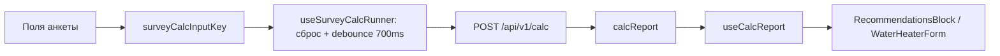

# Frontend: оркестрация расчёта (useSurveyCalcRunner)

Документ описывает слой клиента, который вызывает `POST /api/v1/calc`, хранит отчёт и синхронизируется с формой анкеты.

---

## SSOT calc-state на клиенте

| Ответственность | Модуль |
|-----------------|--------|
| Состояние `calcLoading` / `calcError` / `calcReport` | `frontend/src/hooks/useSurveyCalcRunner.ts` |
| Сброс отчёта и debounce автопересчёта (`SURVEY_CALC_DEBOUNCE_MS = 700`) | тот же хук |
| Сборка тела запроса | `frontend/src/services/buildCalcRequestPayload.ts` |
| Ключ изменений входа (для debounce) | `frontend/src/utils/surveyCalcInputKey.ts` |
| Парсинг отчёта для UI | `frontend/src/hooks/useCalcReport.ts` |

`App.tsx` **не** хранит calc-state напрямую и **не** вызывает `postCalc` — только подключает хук и передаёт `buildCalcPayload`, `canAutoCalc`, `calcInputKey`.

---

## API хука

```typescript
const {
  calcLoading,
  calcError,
  calcReport,
  setCalcReport,              // useSurveyProject (сохранение / загрузка расчёта с сервера)
  beginDraftInitialization,   // guard перед программной загрузкой черновика
  endDraftInitialization,     // снять guard после applySurveyDraftState
  restoreCalcReport,          // lastCalcReport из черновика
  runApiCalc,                 // ручной пересчёт (кнопка)
} = useSurveyCalcRunner({ buildCalcPayload, canAutoCalc, calcInputKey });
```

### Сброс отчёта при вводе

Один `useEffect` на `calcInputKey` (и переход `canAutoCalc` false→true): debounced `runApiCalc` (если `canAutoCalc`). Перед POST сравнивается `JSON.stringify(buildCalcPayload())` с последним **успешным** запросом — дубликаты не уходят (типично: оркестрация комнат, поля ГВС без изменения CalcInput). `runApiCalc`/`buildCalcPayload` — через ref.

Ручной `invalidateCalcReport()` в формах **не нужен** — сброс централизован в хуке.

### `beginDraftInitialization()` + `endDraftInitialization()` + `isDraftInitializingRef`

`beginDraftInitialization()` вызывается в **начале** `applySurveyDraftState` (до пачки `setState`). `endDraftInitialization()` — в `queueMicrotask` **после** `restoreCalcReport`, когда React обработал все обновления. Guard блокирует сброс отчёта и автопересчёт на всём интервале загрузки черновика/проекта.

### `restoreCalcReport(report)`

В конце `applySurveyDraftState`: восстанавливает `lastCalcReport` и очищает `calcError`.

---

## Поток автопересчёта



1. Пользователь меняет поле → `calcInputKey` меняется.
2. Хук сбрасывает старый отчёт и планирует `runApiCalc` через 700 ms.
3. Ответ кладётся в `calcReport` → `useCalcReport` обновляет карточки matching.

---

## Защита от гонок

`runApiCalc` увеличивает `calcSeqRef` на каждый запрос. Устаревший ответ (seq ≠ текущий) игнорируется — актуально при быстрых изменениях формы.

---

## Связанные хуки анкеты (`App.tsx`)

| Хук | Назначение |
|-----|------------|
| `useSurveyCalcRunner` | calc API + report state |
| `useCalcReport` | парсинг report → DTO для UI |
| `useSurveyProject` | файлы, Mongo, hash-URL |
| `useRoomsOrchestration` | синхронизация комнат с objectMeta |
| `useSurveyEstimates` | локальные оценки до API |

---

## Verify

```bash
cd frontend && npm run lint && npm run build
cd backend && npm run verify:survey-draft-migration && npm run verify:water-heater-form
```

См. также: [`water-heater-form.md`](water-heater-form.md), [`survey-draft.md`](survey-draft.md).
