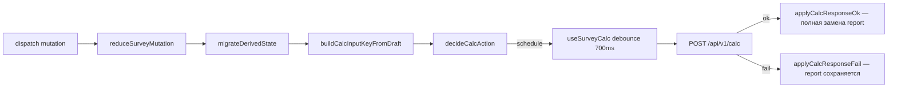

# Frontend: оркестрация расчёта (SurveySession + React Query)

Документ описывает слой клиента: единая сессия анкеты, вызов `POST /api/v1/calc`, хранение отчёта и синхронизация с формой.

См. также: [`survey-draft.md`](survey-draft.md), [`hydraulics-pipeline.md`](hydraulics-pipeline.md) § SurveySession.

---

## SSOT calc-state на клиенте

| Ответственность | Модуль |
|-----------------|--------|
| Состояние `report`, `uiPhase`, `calcInputKey`, черновик | `frontend/src/surveySession/SurveySessionProvider.tsx` |
| Контекст сессии (хук) | `frontend/src/surveySession/useSurveySession.ts` |
| Pipeline мутаций | `runSurveyMutationPipeline.ts` → `reduceSurveyMutation` → `migrateDerivedState` → `decideCalcAction` |
| HTTP calc (debounce, dedup, отмена гонок) | `frontend/src/query/useSurveyCalc.ts` (React Query) |
| Справочники (GET) | `frontend/src/query/queries/*`, композиция — `useReferenceData.ts` |
| Проекты (CRUD) | `frontend/src/query/mutations/useProjectMutations.ts`, `useProjectsListQuery`, `useProjectCalculationsQuery` |
| Сборка тела запроса | `buildCalcPayloadFromDraft` в `buildCalcInputSnapshot.ts` |
| Ключ изменений входа | `buildCalcInputKeyFromDraft` в том же модуле |
| Парсинг отчёта для UI | `frontend/src/hooks/useCalcReport.ts` |

`main.tsx` оборачивает приложение в `QueryProvider` (`@tanstack/react-query`). `App.tsx` — справочники и `SurveySessionProvider`. **`calcReport` не хранится в `App.tsx`** — компоненты читают `report` из контекста сессии.

---

## Pipeline мутации



### `uiPhase`

| Значение | Когда |
|----------|--------|
| `idle` | Нет отчёта, нет пересчёта |
| `stable` | Отчёт актуален |
| `recalculating` | Запланирован или идёт POST calc |
| `error` | Ошибка calc; предыдущий отчёт **не** сбрасывается |

### Смена режима отопления (`HEATING_EMITTERS_MODE_SET`)

При переходе на «Классика» (`presetId: null`):

- сбрасываются `ufhPresetId`, `waterUnderfloorHeating`;
- ТП в комнатах отключается (`enabled: false`);
- пересобирается `wiringLayoutV3`;
- `calcInputKey` меняется → `decideCalcAction` → `schedule` → `uiPhase=recalculating`;
- после успешного POST отчёт **заменяется целиком** (`applyCalcResponseOk`), без domain-merge и без `null` между ответами.

Пока идёт пересчёт, в UI может отображаться **предыдущий** отчёт с индикатором загрузки — это ожидаемо.

### `wiringLayoutV3`

Черновик v4 хранит layout разводки (`systemType`, ветки). При `WIRING_SCHEME_SET` и `SET_ROOMS` — `migrateWiringLayoutOnSystemTypeChange` / `adaptFlatRoomsToWiringLayout`. На сервер уходит через `buildCalcPayloadFromDraft`; граф гидравлики строится в `buildGraph.js`.

---

## React Query: calc

```typescript
const {
  calcLoading,
  calcError,
  scheduleFreshCalc,
  runApiCalc,
  abortInFlightCalc,
} = useSurveyCalc({
  buildCalcPayload,
  canAutoCalc,
  calcInputKey,
  onCalcSuccess,
  onCalcError,
  draftInitializing,
});
```

Отчёт **не** кэшируется в React Query — после успешного POST колбэк пишет `report` в `SurveySession`.

### Debounce и dedup

- `SURVEY_CALC_DEBOUNCE_MS = 700` (`useDebouncedValue` + `useQuery`)
- Перед POST сравнивается `JSON.stringify(payload)` с последним успешным — дубликаты не уходят
- `runApiCalc` (кнопка «Рассчитать») — `useMutation`, сброс dedup и немедленный POST
- `abortInFlightCalc` — `queryClient.cancelQueries({ queryKey: ['calc'] })`

### Загрузка черновика

`DRAFT_LOADED` выставляет `draftInitializing` в pipeline; автопересчёт заблокирован (`enabled: false`). После `endDraftInitializationPhase` — `scheduleFreshCalc`.

---

## React Query: справочники

| Query | Ключ | Сервис |
|-------|------|--------|
| Пресеты ограждений | `['presets','envelope']` | `fetchEnvelopePresets` |
| Базы ТП + финиш | `['presets','underfloor-heating']` | `fetchUnderfloorHeatingPresets` |
| Режимы ТП | `['presets','ufh-modes']` | `fetchUfhModePresets` |
| Каталог | `['catalog']` | `fetchCatalogEquipment` |

`reloadCatalog` — `invalidateQueries` + `refetch` (`useCatalogEquipmentQuery`).

---

## Связанные модули

| Модуль | Назначение |
|--------|------------|
| `QueryProvider` | `QueryClientProvider` + devtools |
| `SurveySessionProvider` | контекст, `dispatch`, `report`, `uiPhase` |
| `useSurveyCalc` | calc API (авто query + ручная mutation) |
| `useReferenceData` | композиция справочных query |
| `useCalcReport` | парсинг report → DTO для UI |
| `useSurveyProject` | файлы, Mongo, hash-URL (поверх project mutations) |
| `useRoomsOrchestration` | синхронизация комнат с objectMeta |
| `useSurveyEstimates` | локальные оценки до API |
| `HydraulicsProposalSection` | блок гидравлики из `matching.hydraulics` |

Ручной `invalidateCalcReport()` в формах **не нужен** — пересчёт централизован в сессии.

---

## Verify

```bash
cd frontend && npm run verify:survey-session
cd frontend && npm run lint && npm run build
cd backend && npm run verify:survey-draft-migration && npm run verify:water-heater-form
```
