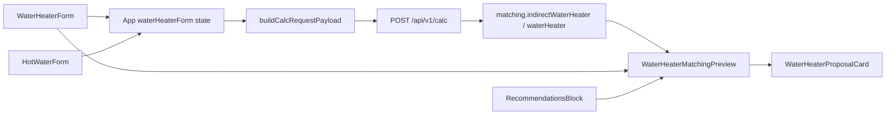

# Форма «Водонагреватель» (WaterHeaterForm)

Документ описывает шаг анкеты **«Водонагреватель»**: стратегические решения пользователя по подбору БКН/электробойлера, связь с API и UI-компонентами.

---

## Цель

Пользователь выбирает **стратегию** ГВС (схему связки котёл / горячая вода), а не модель или литраж вручную. Объём и номенклатура подбираются бэкендом по `recommendedTankLiters` и каталогу.

Шаг 8 roadmap (ручной выбор модели) **не реализован** и в форму не входит.

---

## Разделение шагов анкеты

| Шаг | Компонент | Поля API |
|-----|-----------|----------|
| Горячая вода | `HotWaterForm` | `hotWater.*` — жильцы, точки, температура |
| **Водонагреватель** | **`WaterHeaterForm`** | `heatingSystem.hotWaterBoilerPowerMatchingScheme`, `objectMeta.indirectDhwSpaceAvailable` (условно) |
| Котёл | блок в `App.tsx` | `heatingSystem.thermalRegimePreset` — только радиаторный график |

---

## WaterHeaterFormValue

Файл: `frontend/src/types/waterHeater.ts`

```typescript
{
  hotWaterBoilerPowerMatchingScheme: HotWaterBoilerPowerMatchingScheme;
  indirectDhwSpaceAvailable: boolean;
}
```

Единственный источник правды для флага БКН в UI — `waterHeaterForm`. В `buildCalcRequestPayload` флаг мержится в `objectMeta` через `objectMetaForCalcPayload()`.

---

## Контекстная видимость галочки БКН

Галочка **«Есть место под БКН»** показывается только когда бэкенд проверяет флаг:

- `objectType === 'apartment'`
- `scheme === singleCircuitBoilerWithIndirectTankHeatingPlusTankPowerKw`

Для **дома** галочка не отображается — в `matching/index.js` для дома используется `objectType === 'house'` без `indirectDhwSpaceAvailable`.

Функция: `shouldShowIndirectDhwSpaceCheckbox()` в `frontend/src/utils/waterHeaterSchemeOptions.ts`.

---

## Схемы в селекте

Список опций — `getWaterHeaterSchemeOptions(objectType, apartmentLarge)`:

- **Малая квартира** (площадь ≤ 50 м² и < 2 санузлов/точек ванна+душ): схема «1К + БКН» **скрыта**.
- **Крупная квартира** и **дом**: все 5 схем из `shared/heatingMatchingSchemes.js`.

При недоступной схеме `App.tsx` сбрасывает выбор на `maximumBetweenHeatingLoadWithReserveAndHotWaterPowerKw`.

---

## Поток данных



- **INPUT:** `WaterHeaterForm` (шаг + сайдбар через `onApplyScheme`)
- **OUTPUT:** `WaterHeaterMatchingPreview` → `WaterHeaterProposalCard` (форма и `RecommendationsBlock`)

---

## Компоненты UI (слой результата)

### `WaterHeaterProposalCard`

Discriminated union в `frontend/src/types/waterHeaterMatching.ts`:

```typescript
{ kind: 'indirect'; title; titleDomId; data: ParsedIndirectWaterHeaterMatching }
| { kind: 'electric'; title; titleDomId; data: ParsedWaterHeaterMatching }
```

Специфичные поля БКН (`coilPowerKw`, `effectiveHeatPowerKw`, …) и ЭВН (`powerKw`) читаются **из `data`**, без пропсов `indirect` / `electricPowerKw`.

### `WaterHeaterMatchingPreview`

Единая обёртка рендера обеих карточек. Используется в:

- `WaterHeaterForm` — `idPrefix="wh-form"`, `showPendingHint`, `sectionTitle`
- `RecommendationsBlock` — `idPrefix="sidebar"`

---

## Подписи объёма (контекст vs результат)

| Место | Источник | Подпись в UI |
|-------|----------|--------------|
| Контекст формы | `calculations.hotWater.recommendedTankLiters` | **Рекомендуемый объём (расчёт ГВС)** |
| Карточка подбора | `matching.*.requiredTankLiters` | **Расчётный минимум (подбор)** |

Разные слои отчёта — намеренное разделение «расчёт потребления» и «порог matching».

---

## Реактивность

Изменение схемы или галочки → `invalidateCalcReport()` (`useSurveyCalcRunner`) → `calcInputKey` меняется → debounce **700 ms** → `POST /api/v1/calc` → обновление карточек БКН и ЭВН в форме и в правой колонке.

Подробнее: [`frontend-calc-runner.md`](frontend-calc-runner.md).

---

## Черновик проекта (survey draft)

**Единый контракт:** `SURVEY_DRAFT_SCHEMA_VERSION` и тип `SurveyDraft` в `frontend/src/types/surveyDraft.ts`.

**Загрузка** (файл, `projects.survey`, hash-URL) — только через `migrateSurveyDraft()` (`frontend/src/utils/migrateSurveyDraft.ts`). `parseSurveyDraft` — алиас этой функции.

При загрузке snapshot приводится к текущему контракту:

- `waterHeaterForm` — единственное место хранения схемы ГВС и флага «место под БКН»;
- если в snapshot блока `waterHeaterForm` нет — значения берутся из корневого `hotWaterBoilerPowerMatchingScheme` и `objectMeta.indirectDhwSpaceAvailable`, затем нормализуются;
- `objectMeta.indirectDhwSpaceAvailable` в сохранённом черновике **не хранится** (только в calc через `objectMetaForCalcPayload()`);
- отсутствующие поля заполняются дефолтами (`createDefaultWaterHeaterFormValue()` и др.).

**Запись:** `buildSurveyDraft()` всегда пишет `schemaVersion: SURVEY_DRAFT_SCHEMA_VERSION` и полный `waterHeaterForm`.

См. также: [`survey-draft.md`](survey-draft.md).

---

## Локальная валидация

`validateWaterHeaterForm()` — только **warnings**, без блокировки расчёта:

- схема вне списка доступных;
- «1К + БКН» без галочки места под бойлер;
- нет жильцов и точек на шаге «Горячая вода»;
- «тропический душ» в квартире (не влияет на проток).

---

## Связанные файлы

| Файл | Назначение |
|------|------------|
| `frontend/src/components/WaterHeaterForm/WaterHeaterForm.tsx` | UI формы (стратегия + контекст) |
| `frontend/src/components/WaterHeaterMatchingPreview/WaterHeaterMatchingPreview.tsx` | Общий рендер карточек БКН/ЭВН |
| `frontend/src/components/WaterHeaterProposalCard/WaterHeaterProposalCard.tsx` | Карточка одной линии (read-only) |
| `frontend/src/types/waterHeaterMatching.ts` | Discriminated union пропсов карточки |
| `frontend/src/utils/waterHeaterSchemeOptions.ts` | Фильтр схем, видимость БКН |
| `shared/waterHeaterFormContract.js` | Видимость галочки БКН, мерж `objectMeta.indirectDhwSpaceAvailable` |
| `frontend/src/utils/objectMetaForCalcPayload.ts` | Типизированный re-export shared |
| `frontend/src/hooks/useSurveyCalcRunner.ts` | Calc API, debounce, invalidate/restore report |
| `frontend/src/utils/migrateSurveyDraft.ts` | Нормализация snapshot → SurveyDraft |
| `frontend/src/services/buildCalcRequestPayload.ts` | Сборка CalcInput |
| `backend/src/matching/index.js` | Оркестрация pickIndirect / pickWaterHeater |

См. также: [`heating-schemes-thermal-regime.md`](heating-schemes-thermal-regime.md), [`heating-schemes-test-checklist.md`](heating-schemes-test-checklist.md).

---

## План реализации (выполнено)

1. Типы и утилиты (`waterHeater.ts`, `waterHeaterSchemeOptions`, `validateWaterHeaterForm`, `normalizeWaterHeaterForm`)
2. Компонент `WaterHeaterForm` + CSS
3. Интеграция в `App.tsx`, `useSurveyCalcRunner`, `migrateSurveyDraft`, `surveyCalcInputKey`
4. Удаление дублирующей галочки БКН из `ObjectMetaForm`
5. Перенос селектора схемы со шага «Котёл» на «Водонагреватель»
6. Превью через `WaterHeaterMatchingPreview` на шаге формы и в сайдбаре
7. Рефакторинг: discriminated union в карточке, без дублирующих пропсов
8. Документация (этот файл + обновление смежных docs)

**Не выполнялось:** ручной выбор модели/литража (шаг 8 roadmap).
