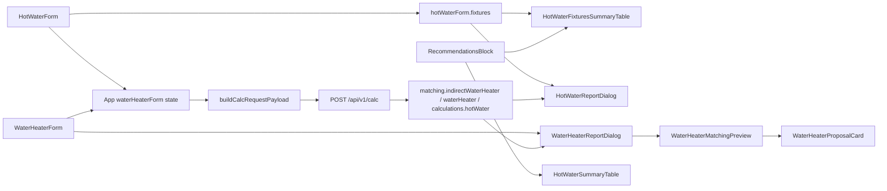

# Форма «Водонагреватель» (WaterHeaterForm)

Документ описывает шаг анкеты **«Водонагреватель»**: стратегические решения пользователя по подбору БКН/электробойлера, связь с API и UI-компонентами.

---

## Цель

Пользователь выбирает **стратегию** ГВС (схему связки котёл / горячая вода), а не модель или литраж вручную. Объём и номенклатура подбираются бэкендом по `recommendedTankLiters` и каталогу.

Шаг 8 roadmap (ручной выбор модели) **не реализован** и в форму не входит.

---

## Разделение шагов анкеты

| Шаг | Компонент | Поля API / UI |
|-----|-----------|---------------|
| Горячая вода | `HotWaterForm` + `HotWaterReportDialog` | `hotWater.*` — ввод; расчёт API — в модалке; точки — ещё в сайдбаре (`HotWaterFixturesSummaryTable`) |
| **Водонагреватель** | **`WaterHeaterForm`** + **`WaterHeaterReportDialog`** | `heatingSystem.hotWaterBoilerPowerMatchingScheme`, `objectMeta.indirectDhwSpaceAvailable` (условно); matching — только в модалке «Отчёт по подбору водонагревателя» |
| Котёл | блок в `App.tsx` | `heatingSystem.thermalRegimePreset` — только радиаторный график |

---

## WaterHeaterFormValue

Файл: `frontend/src/types/waterHeater.ts`

```typescript
{
  hotWaterBoilerPowerMatchingScheme: HotWaterBoilerPowerMatchingScheme;
  indirectDhwSpaceAvailable: boolean;
}
```

Единственный источник правды для флага БКН в UI — `waterHeaterForm`. В `buildCalcRequestPayload` флаг мержится в `objectMeta` через `objectMetaForCalcPayload()`.

---

## Контекстная видимость галочки БКН

Галочка **«Есть место под БКН»** показывается только когда бэкенд проверяет флаг:

- `objectType === 'apartment'`
- `scheme === singleCircuitBoilerWithIndirectTankHeatingPlusTankPowerKw`

Для **дома** галочка не отображается — в `matching/index.js` для дома используется `objectType === 'house'` без `indirectDhwSpaceAvailable`.

Функция: `shouldShowIndirectDhwSpaceCheckbox()` в `frontend/src/utils/waterHeaterSchemeOptions.ts`.

---

## Схемы в селекте

Список опций — `getWaterHeaterSchemeOptions(objectType, apartmentLarge)`:

- **Малая квартира** (площадь ≤ 50 м² и < 2 санузлов/точек ванна+душ): схема «1К + БКН» **скрыта**.
- **Крупная квартира** и **дом**: все 5 схем из `shared/heatingMatchingSchemes.js`.

При недоступной схеме `App.tsx` сбрасывает выбор на `maximumBetweenHeatingLoadWithReserveAndHotWaterPowerKw`.

---

## Поток данных



- **INPUT:** `HotWaterForm` (потребление) + `WaterHeaterForm` (стратегия; `onApplyScheme` в сайдбаре)
- **OUTPUT:**
  - сайдбар после теплопотерь — `HotWaterFixturesSummaryTable` (точки из анкеты, live);
  - `WaterHeaterReportDialog` → `WaterHeaterMatchingPreview` → `WaterHeaterProposalCard` (модалка шага «Водонагреватель»);
  - сайдбар — `HotWaterSummaryTable` (ЭБ/БКН, без карточек matching)

Паттерн UI — как у ТП и ГВ: на форме только ввод + кнопка отчёта; полный результат — в модалке.
На шагах ТП / ГВ / Водонагреватель рядом с отчётом — **«Назад к результатам»**
(`navigateToResultsSection` → якоря `RESULTS_SECTION_IDS` в сайдбаре).

---

## Компоненты UI (слой результата)

### `HotWaterFixturesTable` / `HotWaterFixturesSummaryTable`

Единая таблица точек водоразбора. **SSOT данных — `hotWaterForm.fixtures`** (анкета), не API:

- запись в сессию — `normalizeHotWaterForm` в `reduceSurveyMutation` (`SET_HOT_WATER_FORM`)
  и в `migrateSurveyDraft`;
- calc payload — снова `normalizeHotWaterForm` в `buildCalcRequestPayload`;
- UI — `normalizeHotWaterFixtures` в таблице / `countThermalFixtures` (без `NaN`);
- сайдбар — `HotWaterFixturesSummaryTable` (live при смене анкеты);
- модалка — точки из анкеты **даже без** ответа calc; пик/кВт/бак — из `calculations.hotWater`.

При изменении анкеты таблица обновляется сразу; расчёт API — после debounce, если
`canAutoCalc` (заполнены помещения/ограждения).

### `WaterHeaterProposalCard`

Discriminated union в `frontend/src/types/waterHeaterMatching.ts`:

```typescript
{ kind: 'indirect'; title; titleDomId; data: ParsedIndirectWaterHeaterMatching }
| { kind: 'electric'; title; titleDomId; data: ParsedWaterHeaterMatching }
```

Специфичные поля БКН (`coilPowerKw`, `effectiveHeatPowerKw`, …) и ЭВН (`powerKw`) читаются **из `data`**, без пропсов `indirect` / `electricPowerKw`.

### `WaterHeaterMatchingPreview`

Единая обёртка рендера обеих карточек. Используется **в модалке** отчёта:

- `WaterHeaterReportView` — `idPrefix="wh-report"`

Сайдбар «Итог» — компактная `HotWaterSummaryTable` (строки ЭБ/БКН), без `WaterHeaterMatchingPreview`.

### `WaterHeaterReportDialog`

Модалка полного подбора (паттерн `HotWaterReportDialog` / `UnderfloorHeatingReportDialog`):

- кнопка «Отчёт по подбору водонагревателя» на `WaterHeaterForm`;
- guard — `hasWaterHeaterReportContent(indirect, electric)`.

---

## Подписи объёма (контекст vs результат)

| Место | Источник | Подпись в UI |
|-------|----------|--------------|
| Контекст формы / отчёт ГВ | `calculations.hotWater.recommendedTankLiters` | **Рекомендуемый объём (расчёт ГВС)** |
| Карточка подбора (модалка) | `matching.*.requiredTankLiters` | **Расчётный минимум (подбор)** |

Разные слои отчёта — намеренное разделение «расчёт потребления» и «порог matching».

---

## Реактивность

Изменение схемы или галочки → `calcInputKey` меняется → хук сбрасывает отчёт → debounce **700 ms** → `POST /api/v1/calc` → обновление карточек БКН и ЭВН в модалке отчёта и строк в сайдбаре.

Подробнее: [`frontend-calc-runner.md`](frontend-calc-runner.md).

---

## Черновик проекта (survey draft)

**Единый контракт:** `SURVEY_DRAFT_SCHEMA_VERSION` и тип `SurveyDraft` в `frontend/src/types/surveyDraft.ts`.

**Загрузка** (файл, `projects.survey`, hash-URL) — только через `migrateSurveyDraft()` (`frontend/src/utils/migrateSurveyDraft.ts`). `parseSurveyDraft` — алиас этой функции.

При загрузке snapshot приводится к текущему контракту:

- `waterHeaterForm` — единственное место хранения схемы ГВС и флага «место под БКН»;
- если в snapshot блока `waterHeaterForm` нет — значения берутся из корневого `hotWaterBoilerPowerMatchingScheme` и `objectMeta.indirectDhwSpaceAvailable`, затем нормализуются;
- `objectMeta.indirectDhwSpaceAvailable` в сохранённом черновике **не хранится** (только в calc через `objectMetaForCalcPayload()`);
- отсутствующие поля заполняются дефолтами (`createDefaultWaterHeaterFormValue()` и др.).

**Запись:** `buildSurveyDraft()` всегда пишет `schemaVersion: SURVEY_DRAFT_SCHEMA_VERSION` и полный `waterHeaterForm`.

См. также: [`survey-draft.md`](survey-draft.md).

---

## `tropicalShower` и объём бака

Флаг анкеты `hotWater.tropicalShower` умножает расчётную потребность в объёме на
`water_norms.storage.tropicalShowerVolumeFactor` (**1.3**), затем результат округляется
к `storage.typicalTankSizes`. Коэффициент один и тот же для дома и квартиры.

| Контекст | Где применяется множитель | Модуль |
|----------|---------------------------|--------|
| Дом, сценарий **storage** (БКН / накопитель) | Один раз к `dhwTankLitersCombinedRaw` = max(legacy, сеансовый эквивалент) | `backend/src/logic/hotWater.js` |
| Квартира + схема отдельного ЭВН | К норме `apartmentElectricStorage` до snap | `recommendedApartmentElectricTankLiters` → `buildReport.js` |
| Любой объект + **2К + буферный ЭВН** | К норме `combiBufferElectricStorage` до snap | `recommendedCombiBufferTankLiters` → `buildReport.js` |
| Любой объект + **1К + буферный ЭВН** | К норме `singleCircuitBufferElectricStorage` до snap | `recommendedSingleCircuitBufferTankLiters` → `buildReport.js` |
| Квартира, чистый **flowThrough** без бака | Объём = 0; флаг на литраж не влияет (меняется только если схема задаёт бак) | — |

Общий хелпер snap + tropical для ЭВН/буфера: `snapTankLitersWithTropical` в
`backend/src/utils/apartmentMatching.js`. Legacy-норма storage
(`recommendedStorageTankLitersRaw`) считает только жителей/ванну без множителя;
+30 % в storage-пайплайне накладывается один раз на `combinedRaw` в `hotWater.js`.

Контракт API: `components/schemas/CalcInput.yaml` (`hotWater.tropicalShower`),
норма — `WaterNormsStorage.yaml` (`tropicalShowerVolumeFactor`).

---

## Локальная валидация

`validateWaterHeaterForm()` — только **warnings**, без блокировки расчёта:

- схема вне списка доступных;
- «1К + БКН» без галочки места под бойлер;
- нет жильцов и точек на шаге «Горячая вода».

---

## Связанные файлы

| Файл | Назначение |
|------|------------|
| `frontend/src/components/HotWaterForm/HotWaterForm.tsx` | UI шага «Горячая вода» (ввод + кнопка отчёта) |
| `frontend/src/components/HotWaterReport/HotWaterReportDialog.tsx` | Модалка полного расчёта ГВ |
| `frontend/src/utils/hotWaterFormDefaults.ts` | Дефолты формы ГВ и ключи fixtures |
| `frontend/src/utils/normalizeHotWaterForm.ts` | Нормализация формы/точек (черновик, мутации, calc) |
| `frontend/src/utils/countThermalFixtures.ts` | Итоги точек + guard показа (без NaN) |
| `frontend/src/components/HotWaterReport/HotWaterFixturesTable.tsx` | Таблица точек водоразбора (SSOT UI) |
| `frontend/src/components/HotWaterReport/HotWaterFixturesSummaryTable.tsx` | Та же таблица в сайдбаре «Результаты» |
| `frontend/src/components/HotWaterReport/HotWaterSummaryTable.tsx` | Компактный итог ЭБ/БКН в сайдбаре |
| `frontend/src/components/WaterHeaterForm/WaterHeaterForm.tsx` | UI формы (стратегия + кнопки отчёта и «Назад к результатам») |
| `frontend/src/constants/surveyResultsSections.ts` | Якоря секций сайдбара для «Назад к результатам» |
| `frontend/src/components/SurveyNavigation/SurveyReportActions.module.css` | Общие стили кнопок отчёта / назад |
| `frontend/src/components/WaterHeaterReport/WaterHeaterReportDialog.tsx` | Модалка полного подбора БКН/ЭВН |
| `frontend/src/components/WaterHeaterReport/WaterHeaterReportView.tsx` | Контент модалки |
| `frontend/src/components/WaterHeaterReport/hasWaterHeaterReportContent.ts` | Guard кнопки отчёта |
| `frontend/src/components/WaterHeaterMatchingPreview/WaterHeaterMatchingPreview.tsx` | Рендер карточек БКН/ЭВН в модалке |
| `frontend/src/components/WaterHeaterProposalCard/WaterHeaterProposalCard.tsx` | Карточка одной линии (read-only) |
| `frontend/src/types/waterHeaterMatching.ts` | Discriminated union пропсов карточки |
| `frontend/src/utils/waterHeaterSchemeOptions.ts` | Фильтр схем, видимость БКН |
| `shared/waterHeaterFormContract.js` | Видимость галочки БКН, мерж `objectMeta.indirectDhwSpaceAvailable` |
| `frontend/src/utils/objectMetaForCalcPayload.ts` | Типизированный re-export shared |
| `frontend/src/query/useSurveyCalc.ts` | Calc API (React Query), debounce, draftInitializing guard |
| `frontend/src/utils/migrateSurveyDraft.ts` | Нормализация snapshot → SurveyDraft |
| `backend/src/logic/hotWater.js` | Storage ГВС; tropical к `combinedRaw` |
| `backend/src/utils/apartmentMatching.js` | Объёмы ЭВН/буфера + `snapTankLitersWithTropical` |
| `backend/src/report/buildReport.js` | Overwrite `recommendedTankLiters` для ЭВН/буферных схем |
| `frontend/src/services/buildCalcRequestPayload.ts` | Сборка CalcInput |
| `backend/src/matching/index.js` | Оркестрация pickIndirect / pickWaterHeater |

См. также: [`heating-schemes-thermal-regime.md`](heating-schemes-thermal-regime.md), [`heating-schemes-test-checklist.md`](heating-schemes-test-checklist.md).

---

## План реализации (выполнено)

1. Типы и утилиты (`waterHeater.ts`, `waterHeaterSchemeOptions`, `validateWaterHeaterForm`, `normalizeWaterHeaterForm`)
2. Компонент `WaterHeaterForm` + CSS
3. Интеграция в `App.tsx`, `useSurveyCalc`, `migrateSurveyDraft`, `surveyCalcInputKey`
4. Удаление дублирующей галочки БКН из `ObjectMetaForm`
5. Перенос селектора схемы со шага «Котёл» на «Водонагреватель»
6. Превью через `WaterHeaterMatchingPreview` (сначала на форме, затем в модалке)
7. Рефакторинг: discriminated union в карточке, без дублирующих пропсов
8. Модалка `WaterHeaterReportDialog` по паттерну ГВ/ТП — расчёт matching скрыт под «Отчёт по подбору водонагревателя»
9. Документация (этот файл + обновление смежных docs)

**Не выполнялось:** ручной выбор модели/литража (шаг 8 roadmap).
